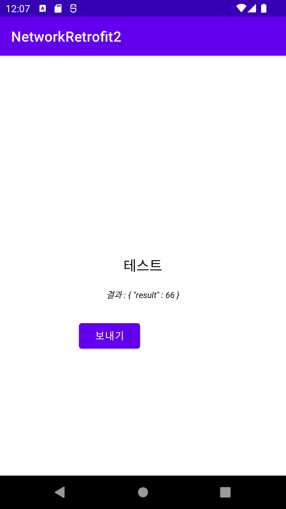
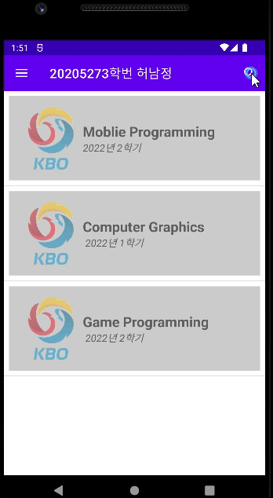
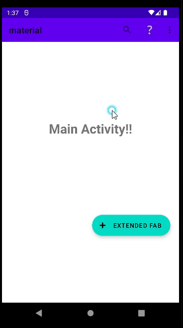

## GitHubAndroid
- 언어 : 코틀린
- 안드로이드의 각종 기능을 테스트 해보고 모듈화시켜 필요할 때 복사할 수 있도록 만들어진 저장소
- 어떤 제품의 프로토타입이든 높은 생산성으로 찍어내릴 수 있다.

#### SQLite CURDModel
- CRUD Model을 미리 구현하여 업로드.
- 개발자는 SQLite Model 을 구현하는데 반복되는 시간을 소요할 필요가 없다.
- 출처 : https://cliearl.github.io/posts/android/implement-crud-with-sqliteopenhelper/

#### notification
- 각각의 notification 명령어들을 사용.
- 각각의 기능들의 클래스를 분리해서 개발.
- 개발자는 필요한 기능들이 있는 클래스를 가져와서 사용할 수 있다.
- 미래에는 애노테이션 기법으로 개발하는 것을 기대  (22.11.08)/ 미래에 내가 해주길 바람.
- this@MainActiviy 으로 context 맥락을 매개변수로 넘겨주면 Acitivity 밖에 클래스에서 기능 분리 개발이 가능하다.

#### servie (미완성)
- 서비스 기능 테스트중.
- https://www.youtube.com/watch?v=PIDL7ZD5E_w 
- 
- 포그라운드 서비스로 작동하지 않을 경우 안드로이드가 자원관리를 위해 죽일 수 있음.

#### Thread  (미완성)
- Thread 기능을 테스트 및 사용.
- 아직 불안정, 향후 고칠 예정.

#### Retrofit2
- Network 요청을 자바 인터페이스 형태(어노테이션)으로 사용할 수 있게 만든 라이브러리이다.
- 기본적으로 REST API 통신을 위해 구현된 라이브러리 입니다.
- 추천 플로그인 : json to kotline class
  - json -> data 클래스로 변경 (model)
- 제작 참고 사이트
  - https://minchanyoun.tistory.com/44
- not permitted by network security policy 에러 -> 안드로이드에서 http 접근이 안되는 경우
  - https://gun0912.tistory.com/80
 

#### JetPack
- JetPackLibrary 기능 테스트
- 왼쪽 슬라이드 fragment, recyclerView, 햄버거 아이콘(더보기), 검색 아이콘(toolbar)  

#### material
- 구글의 머터리얼 디자인은 모바일과 데스크톱, 그리고 그 밖에 다양한 장치를 아루르는 일관된 애플리케이션 디자인 지침
- implementation 'com.google.android.material:material:1.7.0'
- 앱바 레이아웃
  - 컬랩싱 툴바 레이아웃
  - 스크롤 설정
- 탭 레이아웃
- 확장된 플로팅 액션 버튼
- 네비게이션 뷰 - 드로어 화면 구성  

###  JobSchedular
- 사용 : https://github.com/codechacha/JobScheduler

### 소개

안드로이드는 Front View로 가장 빠르게 찍어낼 수 있는 최적의 프레임워크입니다.   
그러나 수십 년간 유지해온 프레임워크 특성상 API를 제공하는 디자인 패턴의 규칙은 계속 바뀌었고, API 또한 계속 바뀌어왔습니다.   
각각의 API를 안드로이드 개발자가 아닌 사람이 항상 기억하고 있기는 너무 버겁습니다. 이 레포는 미리 안드로이드의 필요한 기능을 함수로 구현해놓고 복사와 붙여넣기만으로 빠르게 Front 기능을 찍어내기 위해 만들어진 레포입니다.   
제가 공부하는 용도로 만들었지만 다른 사람들이 필요하면 쓰셔도 좋을 것 같습니다.   

